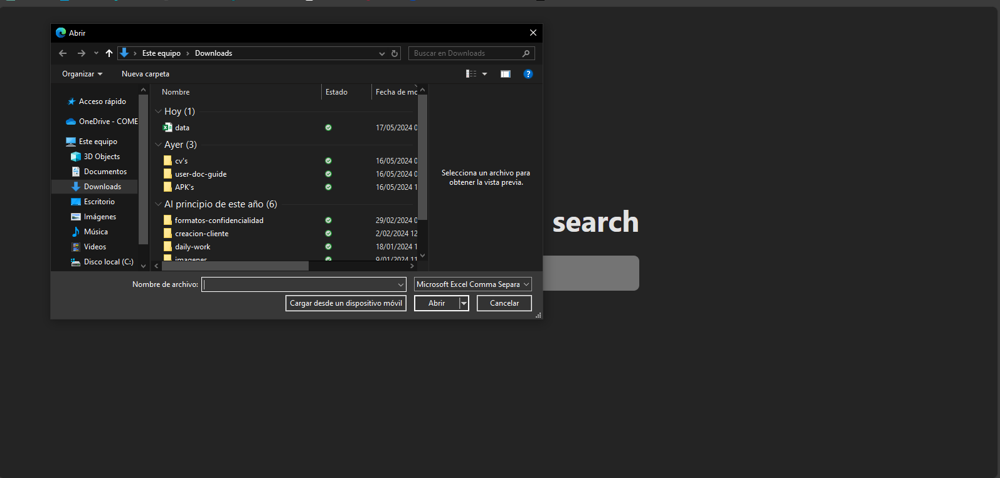
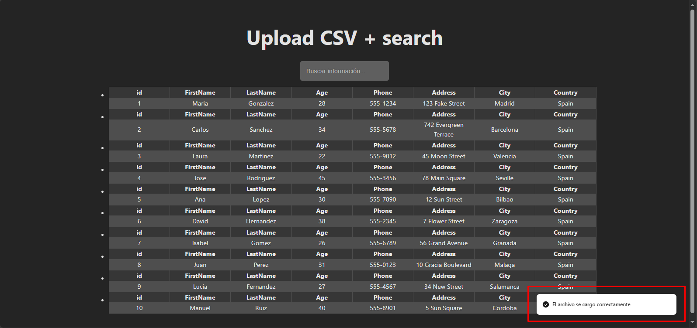
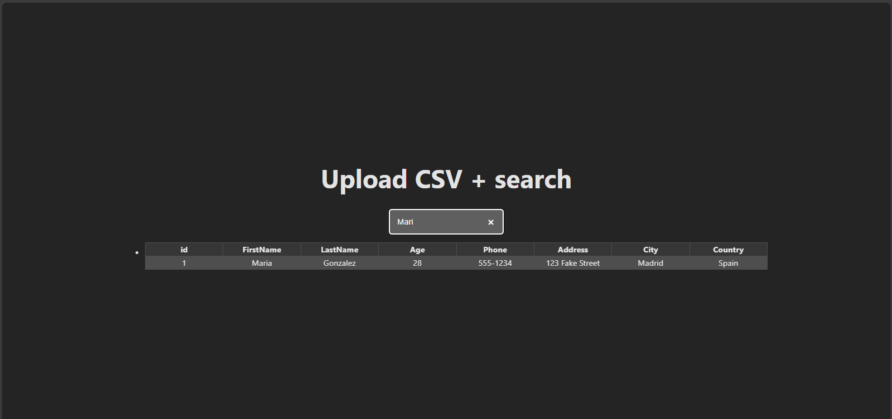

# This is a challenge for a junior test full stack

This project contains the fullstack application, it can recibe a csv file and store in a local storage and send to the back office and then the user can search through the csv file and matching the pattern o letter that he needs to get

## Main screen


## Select the file



## Upload file


## Message and initial information



## Search and filter typing a text



## Technologies used

- Typescript
- Node
- React

## Dependencies used

- express and types
- cors and types
- ts-node and types
- multer and types
- convert-csv-to-json and types
- soonner
- Use de bounce hooks 'useDeBounce' (@uidotdev/usehooks)

## Configurar eslintrc

```node
1. Create a package.json file to the root of the repository

2. install the dependencies got by vite config

3. Move vite (eslintrc.cjs) config to the root of the repository

4. Add node option in true in the file previously added

5. Crea workspace (pnpm-workspace.yaml) and pnpm install --filter [package_name] [command_execution]

6. Run the packages with only one command (pnpm --filter '**' dev ) and then add to the main script

```
